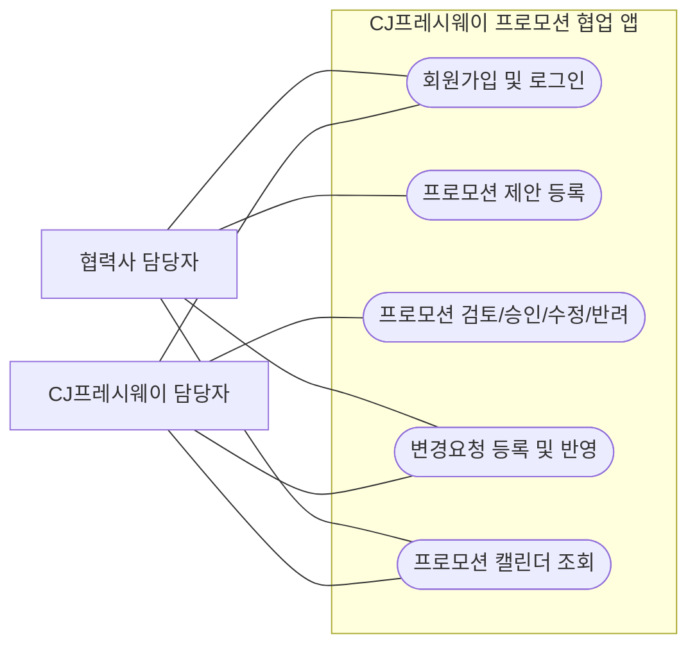

# 유스케이스 다이어그램 - CJ프레시웨이 프로모션 협업 앱

[1-domain-definition.md](./1-domain-definition.md)의 7장 유스케이스를 기반으로 작성.

```mermaid
flowchart LR
    협력사[협력사 담당자]
    CJ프레시웨이[CJ프레시웨이 담당자]

    subgraph 시스템["CJ프레시웨이 프로모션 협업 앱"]
        UC1([회원가입 및 로그인])
        UC2([프로모션 제안 등록])
        UC3([프로모션 검토/승인/수정/반려])
        UC4([변경요청 등록 및 반영])
        UC5([프로모션 캘린더 조회])
    end

    협력사 --- UC1
    협력사 --- UC2
    협력사 --- UC4
    협력사 --- UC5

    CJ프레시웨이 --- UC1
    CJ프레시웨이 --- UC3
    CJ프레시웨이 --- UC4
    CJ프레시웨이 --- UC5
```
