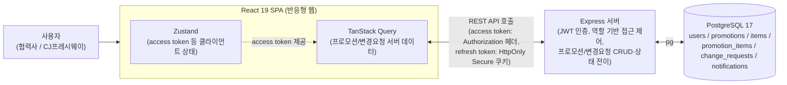
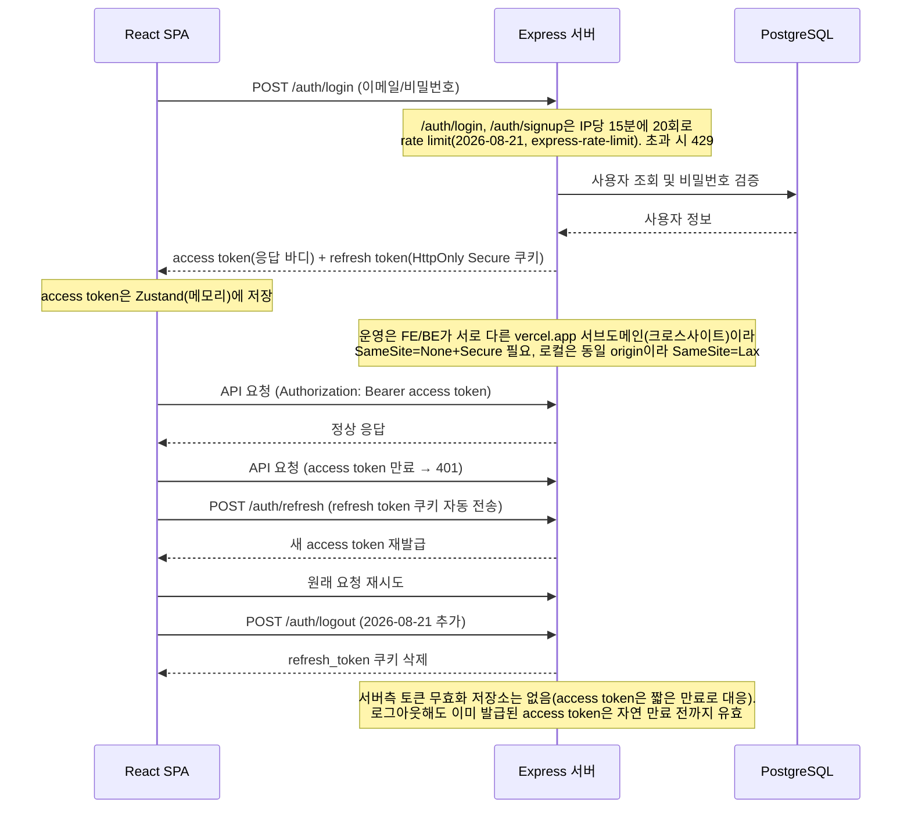
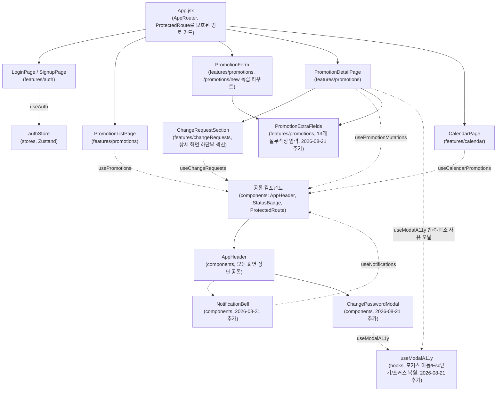

# 기술 아키텍처 다이어그램

> 3일/1인 개발 MVP. 실제 배포/실행 단위(React 클라이언트, Express 서버, PostgreSQL) 수준의 큰 흐름만 표현한다. 레이어 세부 구조(라우트/컨트롤러/서비스 등)는 `5-project-principle.md`를 참고.
>
> **실제 운영 배포(2026-08-21)**: 단일 서버가 아니라 프론트엔드(`https://cjk-007-fe.vercel.app`)와 백엔드(`https://cjk-007-be.vercel.app`)가 각각 별도 Vercel 프로젝트로 분리 배포되어 있고, DB는 Supabase Postgres다. 두 서비스가 서로 다른 `*.vercel.app` 서브도메인(Public Suffix List상 서로 다른 "site")에 있어 브라우저가 크로스사이트로 취급하므로, refresh token 쿠키는 운영에서 `SameSite=None; Secure`, 로컬 개발(동일 origin)에서는 `SameSite=Lax`로 분기 처리한다 (`backend/src/controllers/auth.controller.js`).

## 1. 전체 구성도

## 2. 인증 흐름 (access/refresh token)

## 3. 프론트엔드 컴포넌트 구조

> `5-project-principle.md` 6장의 디렉토리 구조를 페이지/컴포넌트 관계로 표현한 것. 각 feature 화면이 어떤 훅(TanStack Query)과 공통 컴포넌트를 쓰는지만 보여준다.

> 참고: `PromotionForm`은 `PromotionDetailPage`의 자식 컴포넌트가 아니라 `/promotions/new`로 라우팅되는 별도 화면이다. `PromotionDetailPage`의 "수정 후 승인" 인라인 편집 모드는 `PromotionForm`을 재사용하지 않고 자체적으로 구현되어 있다(품목 추가/삭제 UI가 두 파일에 각각 존재).
> `PromotionExtraFields`는 등록(`PromotionForm`)과 상세 편집(`PromotionDetailPage`의 "수정 후 승인"/"재제출") 양쪽에서 공유하는 컴포넌트다.
