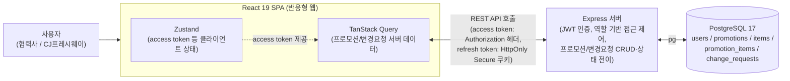
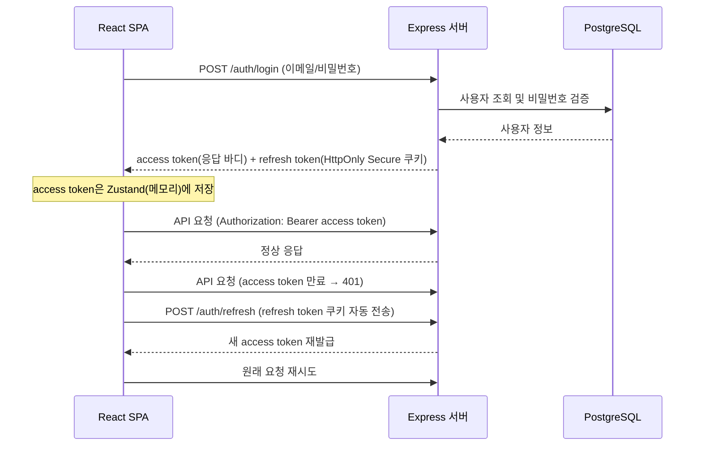

# 기술 아키텍처 다이어그램

> 3일/1인 개발 MVP, 단일 서버 배포 전제. 실제 배포/실행 단위(React 클라이언트, Express 서버, PostgreSQL) 수준의 큰 흐름만 표현한다. 레이어 세부 구조(라우트/컨트롤러/서비스 등)는 `5-project-principle.md`를 참고.

## 1. 전체 구성도

## 2. 인증 흐름 (access/refresh token)

