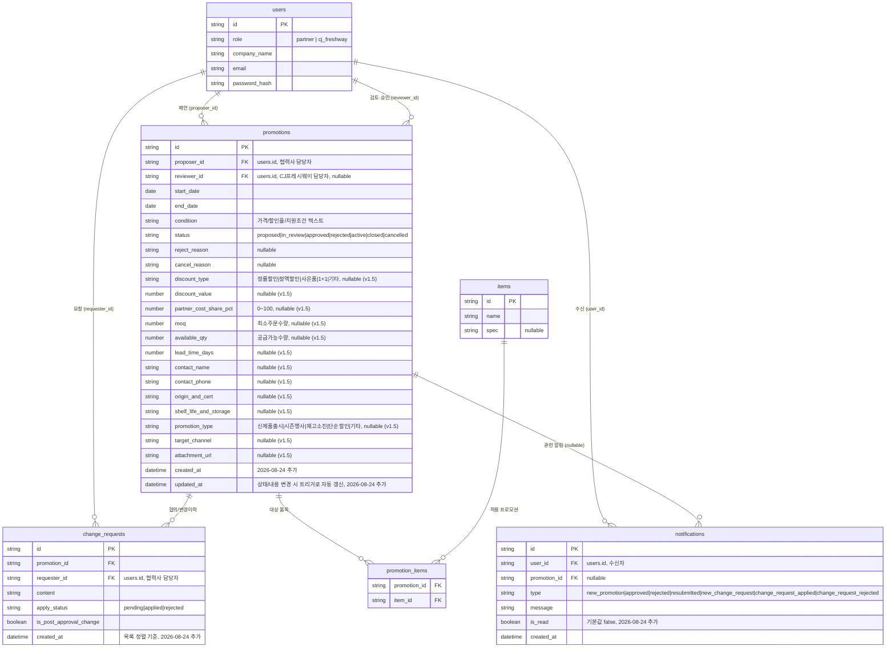

# ERD - CJ프레시웨이 프로모션 협업 앱

> 기준 문서: `1-domain-definition.md`(v1.8), `2-prd.md`(v1.1), `5-project-principle.md`

## 테이블 설명

- **users**: 도메인 정의서 3장의 사용자(User). 협력사/CJ프레시웨이 담당자를 `role`로 구분해 단일 테이블에 저장한다.
- **promotions**: 도메인 정의서 3장의 프로모션(Promotion). 제안자(`proposer_id`)는 필수, 검토자(`reviewer_id`)는 검토/승인/반려/취소 시점에 채워지므로 nullable이다. `discount_type`~`attachment_url`은 협력사 실무 제안 속성으로 전부 선택 입력이다(v1.5, 2026-08-21). `partner_cost_share_pct`는 합의된 조건만 기록하며 실제 정산 처리는 하지 않는다(도메인 정의서 5장 Don't 규칙 준수). `attachment_url`은 파일 업로드 저장소 없이 외부 링크만 저장한다. `created_at`/`updated_at`은 도메인 정의서 5장 Do 규칙(변경 시각 기록)을 지키기 위해 2026-08-24 전체 회귀 테스트에서 추가되었다 — `updated_at`은 `trg_promotions_updated_at` 트리거가 UPDATE마다 자동 갱신한다(서비스 코드 6곳에 각각 반영하는 대신 트리거 하나로 일원화).
- **items**: 도메인 정의서 3장의 대상품목(Item). PRD FR-2에 따라 별도 CRUD 화면 없이 프로모션 등록 폼에서 즉시 생성된다. 한 프로모션당 최대 50개까지 등록할 수 있다(2026-08-24, 대량 등록으로 인한 응답 지연 방지).
- **promotion_items**: 프로모션과 대상품목의 N:M 관계를 표현하는 연결 테이블(PRD 6장 실제 테이블명).
- **change_requests**: 도메인 정의서 3장의 변경요청(ChangeRequest). `is_post_approval_change`로 EC-03(승인후변경) 여부를 구분한다. 이미 처리된(`applied`/`rejected`) 건은 재처리할 수 없다(2026-08-24, 반복 처리로 상태가 뒤집히고 알림이 중복 발송되는 문제 방지). `created_at`은 목록을 등록순으로 정렬하기 위해 2026-08-24 추가되었다(그전에는 컬럼이 없어 DB 삽입순서에 의존했다).
- **notifications**: FR-13(2026-08-21 추가)의 알림. 담당 MD 지정 기능이 없어 CJ프레시웨이용 알림은 전체 CJ프레시웨이 계정에 각각 한 행씩 브로드캐스트된다. `promotions`와 달리 알림은 최신순 조회가 필수 요구사항이라 `created_at`을 둔다(다른 테이블은 정렬 요구가 없어 생략). `is_read`는 헤더 벨의 안읽은 개수 표시와 `/notifications` 전체보기 화면의 개별/전체 읽음 처리를 위해 2026-08-24 추가되었다(FR-13 확장).
