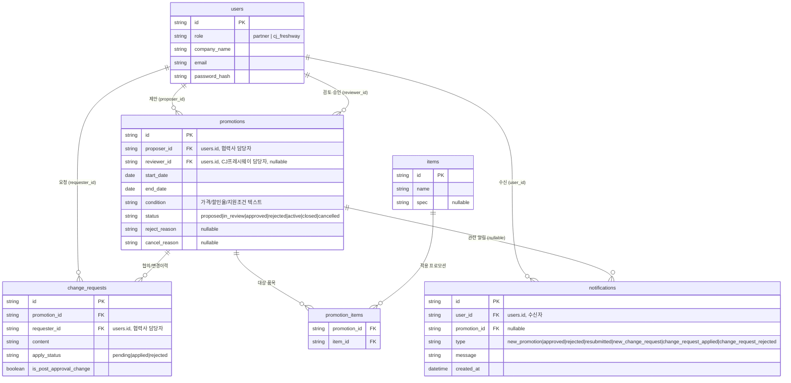

# ERD - CJ프레시웨이 프로모션 협업 앱

> 기준 문서: `1-domain-definition.md`(v1.4), `2-prd.md`(v1.0), `5-project-principle.md`

## 테이블 설명

- **users**: 도메인 정의서 3장의 사용자(User). 협력사/CJ프레시웨이 담당자를 `role`로 구분해 단일 테이블에 저장한다.
- **promotions**: 도메인 정의서 3장의 프로모션(Promotion). 제안자(`proposer_id`)는 필수, 검토자(`reviewer_id`)는 검토/승인/반려/취소 시점에 채워지므로 nullable이다.
- **items**: 도메인 정의서 3장의 대상품목(Item). PRD FR-2에 따라 별도 CRUD 화면 없이 프로모션 등록 폼에서 즉시 생성된다.
- **promotion_items**: 프로모션과 대상품목의 N:M 관계를 표현하는 연결 테이블(PRD 6장 실제 테이블명).
- **change_requests**: 도메인 정의서 3장의 변경요청(ChangeRequest). `is_post_approval_change`로 EC-03(승인후변경) 여부를 구분한다.
- **notifications**: FR-13(2026-08-21 추가)의 알림. 담당 MD 지정 기능이 없어 CJ프레시웨이용 알림은 전체 CJ프레시웨이 계정에 각각 한 행씩 브로드캐스트된다. `promotions`와 달리 알림은 최신순 조회가 필수 요구사항이라 `created_at`을 둔다(다른 테이블은 정렬 요구가 없어 생략).
