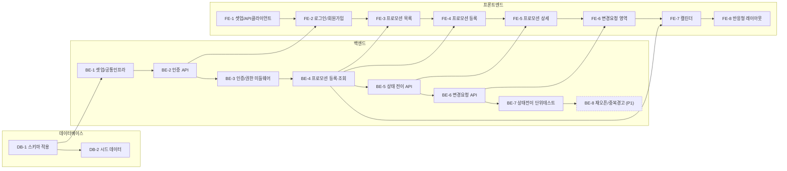

# 실행 계획 - CJ프레시웨이 프로모션 협업 앱

> 기준 문서: `2-prd.md`(FR-1~FR-9), `5-project-principle.md`(디렉토리/레이어 구조), `7-wireframe.md`(화면), `8-schema.sql`(DDL)
> 전제: 3일 / 1인 개발 MVP. P0(FR-1~FR-5, FR-7)를 먼저 끝내고, P1(FR-8, FR-9)은 시간이 남을 때만 착수한다.

## Task 의존 관계 요약

- 백엔드 API가 있어야 프론트 화면을 붙일 수 있으므로 FE-n은 대응하는 BE-n에 의존한다.
- FE-1(프로젝트 셋업)은 BE와 무관하게 먼저 시작 가능하다.
- 점선 테두리(BE-8)는 P1(여유 있을 때만 착수) 항목이다.

---

## 1. 데이터베이스

### DB-1. 데이터베이스 생성 및 스키마 적용
- **선행 Task**: 없음
- **작업 내용**: PostgreSQL 17 데이터베이스를 생성하고 `8-schema.sql`을 실행해 5개 테이블(users, promotions, items, promotion_items, change_requests)을 만든다. 접속 문자열을 `.env`의 `DATABASE_URL`로 관리하고 `.env.example`을 커밋한다.
- **완료 조건**
  - [x] `8-schema.sql` 실행 시 오류 없이 5개 테이블이 생성된다
  - [x] `\d promotions`로 status CHECK 제약(7개 값)과 proposer_id/reviewer_id FK가 확인된다
  - [x] `.env`에 `DATABASE_URL`이 설정되고 `.env.example`이 저장소에 있다 (`.env`는 .gitignore 대상)

### DB-2. 시드 데이터 준비
- **선행 Task**: DB-1
- **작업 내용**: 개발/테스트용 계정과 샘플 프로모션을 넣는다. 협력사 담당자 2명(서로 다른 소속사), CJ프레시웨이 담당자 1명, 상태가 서로 다른 프로모션 3~4건(제안됨/승인됨/종료).
- **완료 조건**
  - [x] 협력사 계정 2개, CJ프레시웨이 계정 1개가 users에 존재한다 (비밀번호는 해시 저장)
  - [x] 서로 다른 status를 가진 프로모션이 3건 이상 존재하고 promotion_items로 품목이 연결되어 있다
  - [x] 시드 스크립트를 반복 실행해도 중복 없이 초기화된다

---

## 2. 백엔드

### BE-1. 프로젝트 셋업 및 공통 인프라
- **선행 Task**: DB-1
- **작업 내용**: Express 앱 골격을 만든다. `5-project-principle.md` 7장 구조(`src/db/pool.js`, `src/middlewares/`, `src/routes/`, `src/controllers/`, `src/services/`, `app.js`, `server.js`)를 그대로 따른다. pg Pool 생성, 공통 에러 핸들러(`{ error: { code, message } }` 단일 포맷), CORS(credentials 허용) 설정 포함.
- **완료 조건**
  - [x] `npm start`로 서버가 기동되고 헬스체크 요청이 200을 반환한다
  - [x] pool을 통해 DB 쿼리가 성공한다 (예: `SELECT 1`)
  - [x] 존재하지 않는 경로 요청 시 공통 에러 포맷 `{ error: { code, message } }`로 404가 반환된다

### BE-2. 인증 API (FR-1)
- **선행 Task**: BE-1
- **작업 내용**: 회원가입/로그인/토큰 재발급 API를 만든다. `POST /auth/signup`(role, 소속사명, 이메일, 비밀번호), `POST /auth/login`, `POST /auth/refresh`. 비밀번호는 bcrypt 해시 저장, access token은 응답 바디로, refresh token은 HttpOnly Secure 쿠키로 내려준다.
- **완료 조건**
  - [x] 회원가입 후 동일 이메일로 재가입 시 409가 반환된다
  - [x] 로그인 성공 시 access token(바디) + refresh token(HttpOnly 쿠키)이 발급된다
  - [x] 잘못된 비밀번호로 로그인 시 401과 오류 메시지가 반환된다 (EC-06)
  - [x] refresh 쿠키로 `/auth/refresh` 호출 시 새 access token이 발급된다

### BE-3. 인증/권한 미들웨어
- **선행 Task**: BE-2
- **작업 내용**: `middlewares/auth.js`(Authorization 헤더의 access token 검증 후 `req.user` 주입)와 `middlewares/requireRole.js`(협력사/CJ프레시웨이 역할 체크)를 만든다.
- **완료 조건**
  - [x] 토큰 없이 보호된 API 호출 시 401이 반환된다
  - [x] 만료된 access token으로 호출 시 401이 반환된다 (프론트의 refresh 재시도 트리거)
  - [x] 권한이 없는 역할로 호출 시 403이 반환된다

### BE-4. 프로모션 등록·조회 API (FR-2, FR-7)
- **선행 Task**: BE-3
- **작업 내용**: `POST /promotions`(협력사만, 기간·대상 품목·조건 입력, 품목명은 즉시 items에 생성 후 promotion_items 연결), `GET /promotions`(역할별 조회 범위 + 상태 필터), `GET /promotions/:id`, `GET /promotions?from=&to=`(캘린더용 기간 조회).
- **완료 조건**
  - [x] 협력사 계정으로 등록 시 status가 `proposed`로 생성되고 품목이 promotion_items에 연결된다
  - [x] 필수값(기간/대상 품목/조건) 누락 시 400과 오류 메시지가 반환된다
  - [x] 협력사 계정 조회 시 본인이 등록한 프로모션만, CJ프레시웨이 계정 조회 시 전체가 반환된다
  - [x] CJ프레시웨이 계정으로 등록 시도 시 403이 반환된다
  - [x] 기간 조회로 특정 월/주/일과 겹치는 프로모션만 반환된다

### BE-5. 프로모션 상태 전이 API (FR-3, FR-4)
- **선행 Task**: BE-4
- **작업 내용**: `PATCH /promotions/:id/approve`, `/reject`, `/cancel`, `PATCH /promotions/:id`(수정 후 승인). 상태 전이 규칙(`1-domain-definition.md` 6장)을 `promotions.service.js`의 순수 함수로 모아 구현하고, 승인/반려 시 reviewer_id를 기록한다.
- **완료 조건**
  - [x] 승인 시 status가 `approved`로 바뀌고 reviewer_id가 채워진다
  - [x] 반려사유 없이 반려 요청 시 400이 반환되고, 사유를 넣으면 `rejected`로 전이되며 reject_reason이 저장된다
  - [x] 취소사유 없이 취소 요청 시 400이 반환되고, 사유를 넣으면 `cancelled`로 전이되며 cancel_reason이 저장된다
  - [x] 협력사 계정으로 승인/반려/취소/수정 호출 시 403이 반환된다 (EC-01)
  - [x] 허용되지 않은 상태 전이(예: `closed` → `approved`) 요청 시 409가 반환된다

### BE-6. 변경요청 API (FR-5)
- **선행 Task**: BE-5
- **작업 내용**: `POST /promotions/:id/change-requests`(협력사만, apply_status는 `pending`으로 생성, 대상 프로모션이 `approved` 이후면 `is_post_approval_change=true`), `GET /promotions/:id/change-requests`, `PATCH /change-requests/:id`(CJ프레시웨이만, `applied`/`rejected` 처리).
- **완료 조건**
  - [x] 협력사가 변경요청 등록 시 apply_status가 `pending`으로 저장된다
  - [x] 승인됨/진행중/종료/취소됨 상태(approved/active/closed/cancelled)의 프로모션에 대한 요청은 `is_post_approval_change=true`로 저장된다 (EC-03)
  - [x] 변경요청 등록 후에도 프로모션 status는 `approved`를 유지한다 (검토중으로 되돌아가지 않음)
  - [x] CJ프레시웨이가 처리 시 apply_status가 `applied`/`rejected`로 갱신되고, 협력사가 처리 시도 시 403이 반환된다

### BE-7. 상태 전이 단위 테스트
- **선행 Task**: BE-6
- **작업 내용**: `5-project-principle.md` 4장 원칙에 따라 상태 전이 규칙과 EC-03 판단 로직에만 단위 테스트를 작성한다. 프레임워크 추가 없이 `node:test` + `assert` 사용. CRUD성 API는 테스트하지 않는다.
- **완료 조건**
  - [x] 정상 전이 경로(proposed→in_review→approved→active→closed, proposed→rejected→proposed)가 통과한다 (구현된 구간만 — 아래 참고)
  - [x] 금지된 전이(예: closed→approved)가 거부되는 케이스가 테스트된다
  - [x] `is_post_approval_change` 판단 함수가 승인 전/후 케이스 모두에서 검증된다
  - [x] `node --test`로 전체 테스트가 통과한다

> 참고: `in_review` 진입, `approved→active`, `active→closed`, `rejected→proposed`(재제안) 전이는 BE-1~BE-9 어디에도 대응하는 API/함수가 없어 MVP 범위 밖으로 확인됨(도메인 정의서 6장에는 개념으로만 존재). 실제 구현된 구간(proposed/in_review→approved/rejected, approved/active→cancelled)만 단위 테스트로 검증했다.

### BE-8. (P1) 재오픈 및 기간 중복 경고 (FR-8, FR-9)
- **선행 Task**: BE-7
- **작업 내용**: `PATCH /promotions/:id/reopen`(CJ프레시웨이만, `closed`/`cancelled` → `in_review`), 그리고 등록·승인 시점의 기간 중복 검사(동일 품목 + 동일 공급사 기준, 1일 이상 겹치면 경고 응답에 포함하되 차단하지 않음).
- **완료 조건**
  - [x] `closed`/`cancelled` 프로모션만 `in_review`로 재오픈되고, 그 외 상태는 409가 반환된다 (EC-02)
  - [x] 협력사 계정으로 재오픈 시도 시 403이 반환된다
  - [x] 동일 품목·동일 공급사로 기간이 1일 이상 겹치면 응답에 경고 정보가 포함되되 등록 자체는 성공한다 (EC-05)

### BE-9. (P1) 비밀번호 변경 (FR-11, 2026-08-21 추가)
- **선행 Task**: BE-2
- **작업 내용**: `PATCH /auth/password`(인증 필요). 현재 비밀번호를 bcrypt로 검증한 뒤 새 비밀번호(8자 이상)로 해시를 교체한다. 이메일 발송이 필요한 '찾기(재설정)' 플로우는 외부 인프라 도입 결정이 필요해 별도로 남겨둔다.
- **완료 조건**
  - [x] 현재 비밀번호가 올바르고 새 비밀번호가 8자 이상이면 변경되고, 이후 새 비밀번호로만 로그인된다
  - [x] 현재 비밀번호가 틀리면 401이 반환된다
  - [x] 인증되지 않은 요청은 401이 반환된다
  - [x] 새 비밀번호가 8자 미만이면 400이 반환된다

### BE-10. (P0) 반려된 프로모션 재제출 (FR-12, 2026-08-21 추가)
- **선행 Task**: BE-4, BE-5
- **작업 내용**: `PATCH /promotions/:id/resubmit`(협력사 본인만, `rejected` → `proposed`). 기간/조건/품목을 갈아엎듯 전량 교체하고(`updateAndApprovePromotion`의 품목 교체 로직과 동일 패턴) `reject_reason`을 초기화한다.
- **완료 조건**
  - [x] `rejected` 상태의 본인 프로모션만 재제출되어 `proposed`로 전이되고 `reject_reason`이 `null`이 된다
  - [x] 필수 항목(기간/조건/품목 1개 이상)이 없으면 400이 반환된다
  - [x] 제안자 본인이 아니면 403, `rejected`가 아닌 상태면 409가 반환된다
  - [x] CJ프레시웨이 계정으로 호출 시 403이 반환된다

### BE-11. (P0) 알림 (FR-13, 2026-08-21 추가)
- **선행 Task**: BE-4, BE-5, BE-6, BE-10
- **작업 내용**: `notifications` 테이블(`8-schema.sql`) 추가. `GET /notifications?limit=`(기본 5, 최대 50, 최신순)로 본인 알림을 조회한다. 아래 이벤트에서 관련 사용자에게 알림을 생성한다 — 담당 MD 지정 기능이 없어 CJ프레시웨이용 알림은 전체 CJ프레시웨이 계정에 브로드캐스트한다.
  - 신규 프로모션 등록 → 전체 CJ프레시웨이
  - 승인/반려(수정 후 승인 포함) → 제안자
  - 재제출 → 전체 CJ프레시웨이
  - 변경요청 등록 → 전체 CJ프레시웨이
  - 변경요청 반영완료/반영거부 → 요청자
- **완료 조건**
  - [x] 위 6개 이벤트 발생 시 대상 사용자에게 알림이 생성된다
  - [x] `GET /notifications`는 본인에게 온 알림만, 최신순으로, `limit` 파라미터만큼 반환한다
  - [x] 인증되지 않은 요청은 401이 반환된다

### BE-12. (P0) 협력사 제안 등록 실무 속성 (FR-2 확장, 2026-08-21 추가)
- **선행 Task**: BE-4, BE-10
- **작업 내용**: `promotions` 테이블에 13개 선택 필드 추가(할인유형/할인값/협력사부담율/최소주문수량/공급가능수량/리드타임/담당자명·연락처/원산지·인증정보/유통기한·보관조건/프로모션유형/적용채널/첨부링크). `createPromotion`/`updateAndApprovePromotion`/`resubmitPromotion` 세 곳 모두 전달 시 저장/수정하도록 확장하고, `discount_type`/`promotion_type`은 허용값 목록으로, `partner_cost_share_pct`는 0~100 범위로 앱 레이어에서도 검증한다(DB CHECK 제약과 이중 방어).
- **완료 조건**
  - [x] 등록 시 13개 필드를 함께 보내면 그대로 저장·응답된다
  - [x] 13개 필드를 모두 비워도 정상 등록된다(전부 선택 입력)
  - [x] 허용되지 않은 `discount_type`/`promotion_type`, 범위를 벗어난 `partner_cost_share_pct`는 400이 반환된다
  - [x] "수정 후 승인", "재제출" 두 경로에서도 13개 필드를 함께 수정할 수 있다

### BE-13. (Critical/High) 출하검사 하드닝 (2026-08-21 추가)
- **선행 Task**: BE-4~BE-12
- **작업 내용**: 병렬 코드 검증(백엔드/보안/테스트 4개 관점)에서 나온 Critical·High 항목을 조치.
  - 상태 전이 UPDATE(승인/반려/취소/재오픈/재제출/수정후승인) 전부에 `WHERE ... AND status = ANY(허용상태)` 가드 추가, 0행이면 409(레이스 컨디션 방지)
  - `createChangeRequest`에 소유권(proposer_id) 검증 추가(IDOR 방지)
  - 알림 발송(`notifyUser`/`notifyAllCjFreshway`) 실패가 이미 커밋된 본 작업까지 500으로 만들지 않도록 `.catch`로 격리
  - `/auth/login`, `/auth/signup`에 rate limit 추가(15분당 20회, 인스턴스 메모리 기반)
- **완료 조건**
  - [x] 동시에 승인/반려 요청을 보내면 하나만 200, 나머지는 409가 반환된다
  - [x] 다른 협력사의 프로모션에 변경요청 등록 시도 시 403이 반환된다
  - [x] 알림 발송 실패가 본 API 응답의 성공 여부에 영향을 주지 않는다(코드 리뷰로 확인, 실패 주입 테스트는 없음)

### BE-14. (Medium) 출하검사 하드닝 2차 (2026-08-21 추가)
- **선행 Task**: BE-13
- **작업 내용**: 병렬 코드 검증에서 나온 Medium 항목 중 백엔드 몫을 조치.
  - 회원가입 비밀번호 8자 이상 강제(비밀번호 변경 정책과 통일)
  - 에러 핸들러가 `err.status` 없는(처리 안 된) 예외는 원본 메시지 대신 고정 문구로 응답, 상세는 로그로만
  - 앱 부팅 시 필수 env var(`DATABASE_URL`/`JWT_ACCESS_SECRET`/`JWT_REFRESH_SECRET`/`CORS_ORIGIN`) 누락 시 즉시 종료(fail-fast)
  - `POST /auth/logout` 추가(refresh_token 쿠키 삭제) — 서버측 토큰 무효화 저장소는 두지 않음(과설계 방지, access token은 짧은 만료로 대응)
  - 13개 실무속성 중 숫자 필드(할인값/최소주문수량/공급가능수량/리드타임)에 0 이상 검증 추가
- **완료 조건**
  - [x] 8자 미만 비밀번호로 회원가입 시 400이 반환된다
  - [x] 로그아웃 호출 시 응답에 `refresh_token=;`(삭제) `Set-Cookie`가 포함된다
  - [x] 음수 할인값/최소주문수량/공급가능수량/리드타임은 400이 반환되고, 0은 허용된다

### BE-15. (Low) 출하검사 하드닝 3차 (2026-08-21 추가)
- **선행 Task**: BE-14
- **작업 내용**: 병렬 코드 검증에서 나온 Low 항목을 조치.
  - `jwt.sign`/`jwt.verify`에 `algorithm`/`algorithms: ['HS256']` 명시(라이브러리 기본값 의존 제거)
  - EC-05(기간 중복 경고)의 승인 시점 경로(`updateAndApprovePromotion`) 및 "동일 품목 AND 동일 공급사" 조건을 각각 분리해 검증하는 테스트 추가(기존엔 등록 시점·동시 충족 케이스만 있었음)
  - 재제출/알림/13개 실무속성이 한 흐름 안에서 서로 간섭 없이 동작하는지 검증하는 교차 통합테스트 추가(`integration-cross-feature.test.js`) — 재제출 시 보낸 필드만 갱신되고 안 보낸 필드는 유지되는지, 등록→반려→재제출→승인 전체 흐름에서 알림이 정확한 개수로만 쌓이는지, 승인후변경(변경요청)과 실무속성이 서로 값을 침범하지 않는지
- **완료 조건**
  - [x] 승인 시점에도 동일 회사·동일 품목·기간 겹침이면 `overlap_warning: true`가 반환된다
  - [x] 동일 회사·다른 품목, 다른 회사·동일 품목은 각각 겹쳐도 `overlap_warning: false`다
  - [x] 재제출 시 보내지 않은 실무속성은 기존 값이 유지되고, 등록→반려→재제출→승인 흐름에서 알림 4종(신규등록/반려/재제출/승인)이 각각 정확히 1건씩 생성된다

### FE-15. (Low) 프론트엔드 테스트 도입 (2026-08-21 추가)
- **선행 Task**: FE-12
- **작업 내용**: 프론트엔드에 처음으로 자동화 테스트를 도입했다. 번들러/새 의존성 없이 Node 내장 `node --test`로 돌리기 위해, JSX가 없는 순수 로직(`PromotionExtraFields.jsx`의 필드 변환 함수)을 `promotionExtraFieldsUtils.js`로 분리하고 그 파일만 테스트한다. Zustand 스토어(`authStore`)처럼 extension-less relative import를 쓰는 파일은 Node 네이티브 ESM 로더가 해석하지 못해(Vite는 되지만 Node는 확장자 필요) 이번 범위에서는 제외했다 — 번들러 인식 테스트 러너(vitest 등) 도입은 별도 결정 필요.
- **완료 조건**
  - [x] `npm test`(frontend)로 `extraFieldsToPayload`/`extraFieldsFromPromotion`의 빈값→null 변환, 숫자 캐스팅, undefined 방어를 검증하는 테스트 4건이 통과한다
  - [x] 프론트엔드 빌드(`npm run build`)가 리팩터링 이후에도 동일하게 통과한다(동작 변경 없음)

---

## 3. 프론트엔드

### FE-1. 프로젝트 셋업 및 API 클라이언트
- **선행 Task**: 없음 (BE와 병행 가능, 단 실제 통신 확인은 BE-2 이후)
- **작업 내용**: React 19 프로젝트를 만들고 `5-project-principle.md` 6장 구조(`src/api`, `src/stores`, `src/features`, `src/components`, `src/routes`)를 잡는다. Zustand `authStore`(access token, 로그인 사용자), TanStack Query Provider, `api/client.js`(baseURL, Authorization 헤더 자동 첨부, 401 시 `/auth/refresh` 호출 후 원요청 1회 재시도), 라우터 설정.
- **완료 조건**
  - [x] 개발 서버가 기동되고 라우팅으로 화면 전환이 된다
  - [x] API 클라이언트가 access token을 Authorization 헤더에 자동으로 붙인다
  - [x] 401 응답 시 refresh를 1회 호출하고 원요청을 재시도한다 (무한 재시도 없음)
  - [x] 미인증 상태로 보호된 경로 접근 시 로그인 화면으로 리다이렉트된다

### FE-2. 로그인 / 회원가입 화면 (FR-1)
- **선행 Task**: FE-1, BE-2
- **작업 내용**: `7-wireframe.md` 1~2번 화면을 구현한다. 역할(협력사/CJ프레시웨이) 라디오 선택이 있는 회원가입 폼, 로그인 폼, 오류 메시지 표시.
- **완료 조건**
  - [x] 회원가입 성공 시 로그인 화면으로 이동한다
  - [x] 로그인 성공 시 access token이 Zustand에 저장되고 프로모션 목록으로 이동한다
  - [x] 로그인 실패 시 폼 상단에 오류 메시지가 표시된다 (EC-06)
  - [x] 새로고침 시 refresh 쿠키로 세션이 복구되거나 로그인 화면으로 이동한다 (메모리 토큰 소실 처리)

### FE-3. 프로모션 목록 화면 (FR-2 목록, FR-7 진입점)
- **선행 Task**: FE-2, BE-4
- **작업 내용**: `7-wireframe.md` 3번 화면을 구현한다. 상태 필터 드롭다운, 목록 테이블(제목/기간/상태/제안자), 협력사에게만 보이는 `[+ 프로모션 등록]` 버튼, 행 클릭 시 상세 이동. TanStack Query 훅 `usePromotions`로 조회.
- **완료 조건**
  - [x] 협력사 로그인 시 본인 프로모션만, CJ프레시웨이 로그인 시 전체가 표시된다
  - [x] 상태 필터 변경 시 목록이 재조회된다
  - [x] `[+ 프로모션 등록]` 버튼이 협력사에게만 노출된다
  - [x] 행 클릭 시 해당 프로모션 상세로 이동한다
  - [x] 필터 변경 시 자동 재조회는 유지하되, 사용자가 수동으로 재조회할 수 있는 "조회" 버튼도 보조로 노출된다 (2026-08-21 추가, 캘린더 화면도 동일 패턴 적용)
  - [x] 목록은 페이지네이션되어(기본 20건/페이지) 전체 데이터를 무제한 렌더링하지 않고, 페이지 이동 버튼으로 다음/이전 페이지를 조회한다 (2026-08-21 추가, `GET /promotions`의 page/limit 파라미터 — from/to로 조회하는 캘린더 화면은 대상 아님)

### FE-4. 프로모션 등록 화면 (FR-2)
- **선행 Task**: FE-3, BE-4
- **작업 내용**: `7-wireframe.md` 4번 화면을 구현한다. 기간(시작일/종료일), 품목명·규격 입력 후 `[+ 추가]`로 목록에 쌓는 UI, 조건 텍스트 입력, 필수값 검증 메시지.
- **완료 조건**
  - [x] 품목을 추가/삭제할 수 있고 최소 1개 없이는 제출되지 않는다
  - [x] 필수값 누락 시 폼 내 오류 메시지가 표시된다
  - [x] 등록 성공 시 목록 화면으로 이동하고 새 프로모션이 '제안됨'으로 보인다

### FE-5. 프로모션 상세 화면 (FR-3, FR-4)
- **선행 Task**: FE-4, BE-5
- **작업 내용**: `7-wireframe.md` 5번 화면 상단부를 구현한다. 상태/제안자/기간/품목/조건 표시, 역할·상태에 따라 노출되는 액션 버튼(승인/수정 후 승인/반려/취소), 반려·취소 시 사유 입력 모달, "수정 후 승인"은 상단 필드 인라인 편집 모드.
- **완료 조건**
  - [x] 협력사에게는 액션 버튼 대신 "직접 수정 불가 - 변경요청 안내" 문구가 표시된다 (EC-01)
  - [x] CJ프레시웨이에게 현재 상태에서 가능한 버튼만 활성화되어 보인다
  - [x] 반려/취소 시 사유를 입력해야 확정되고, 처리 후 상태 배지가 즉시 갱신된다
  - [x] 수정 후 승인 시 변경된 기간/품목/조건이 반영된 채로 '승인됨'이 된다
  - [x] `closed`/`cancelled` 상태에서 CJ프레시웨이에게 "재오픈" 버튼이 노출되고, 클릭 시 `in_review`로 전이된다 (BE-8, FR-8 — 2026-08-21 추가)

### FE-6. 변경요청 영역 (FR-5)
- **선행 Task**: FE-5, BE-6
- **작업 내용**: `7-wireframe.md` 5번 화면 하단부를 구현한다. 협력사용 변경요청 등록 폼, 요청 이력 목록(요청자/일시/내용/반영여부, 승인후변경 표시), CJ프레시웨이용 `[반영완료]`/`[반영거부]` 버튼.
- **완료 조건**
  - [x] 협력사가 변경요청 등록 시 이력 최상단에 '대기'로 추가된다
  - [x] 승인 이후 등록된 요청에 "승인후변경" 표시가 보인다
  - [x] CJ프레시웨이가 반영완료/반영거부 처리 시 해당 항목의 반영여부가 갱신된다
  - [x] 협력사에게는 반영완료/반영거부 버튼이 보이지 않는다

### FE-7. 캘린더 화면 (FR-7)
- **선행 Task**: FE-6, BE-4
- **작업 내용**: `7-wireframe.md` 6번 화면을 구현한다. 월/주/일 뷰 전환 탭, 이전/다음 기간 이동, 기간과 겹치는 프로모션 목록 표시(날짜 셀별 텍스트 나열, 와이어프레임의 시각적 스팬 막대는 구현하지 않음 — 완료조건 충족에 불필요한 레이아웃 복잡도로 판단), 클릭 시 상세 이동. 외부 캘린더 라이브러리 도입은 선택 사항이되 직접 구현이 길어지면 라이브러리를 쓴다.
- **완료 조건**
  - [x] 월 뷰에서 해당 월과 겹치는 진행 중·예정 프로모션이 표시된다
  - [x] 월/주/일 탭 전환 시 조회 범위가 바뀌어 재조회된다
  - [x] 프로모션 클릭 시 상세 화면으로 이동한다

### FE-8. 반응형 레이아웃 적용
- **선행 Task**: FE-7
- **작업 내용**: `7-wireframe.md` 0장의 브레이크포인트 전략(`@media (max-width: 767px)` 1개)을 적용한다. 목록 표→카드, 등록 폼 가로 배치→세로 스택, 상세 액션 버튼 세로 배치, 캘린더 그리드→날짜별 리스트. 컴포넌트를 분기하지 않고 CSS로만 전환한다.
- **완료 조건**
  - [x] 375px 폭에서 모든 화면이 가로 스크롤 없이 표시된다
  - [x] 목록이 카드형으로, 캘린더가 날짜별 리스트로 전환된다
  - [x] 1024px 이상에서 기존 데스크톱 레이아웃이 그대로 유지된다
  - [x] 브레이크포인트별 별도 컴포넌트 분기 없이 CSS만으로 처리되었다

### FE-9. (P1) 비밀번호 변경 모달 (FR-11, 2026-08-21 추가)
- **선행 Task**: FE-1, BE-9
- **작업 내용**: `AppHeader`에 "비밀번호 변경" 버튼을 추가하고, 현재/새 비밀번호(확인 포함) 입력 모달(`ChangePasswordModal`)에서 `PATCH /auth/password`를 호출한다. 새 화면을 추가하지 않고 기존 모달 패턴(반려/취소 사유 모달과 동일한 `.modal-overlay`/`.modal-box`)을 재사용한다.
- **완료 조건**
  - [x] 새 비밀번호가 8자 미만이거나 확인 값과 다르면 폼 내 오류 메시지가 표시되고 API를 호출하지 않는다
  - [x] 현재 비밀번호가 틀리면 서버 오류 메시지가 표시된다
  - [x] 변경 성공 시 성공 토스트가 표시되고 모달이 닫힌다

### FE-10. (P0) 반려된 프로모션 재제출 UI (FR-12, 2026-08-21 추가)
- **선행 Task**: FE-5, BE-10
- **작업 내용**: `PromotionDetailPage.jsx`에서 협력사 계정 + `rejected` 상태일 때 EC-01 안내 문구 대신 "수정 후 재제출" 버튼을 노출한다. 클릭 시 CJ프레시웨이의 "수정 후 승인"과 동일한 인라인 편집 모드(기간/품목/조건)로 진입하고, "재제출" 버튼으로 `useResubmitPromotion`을 호출한다.
- **완료 조건**
  - [x] `rejected` 상태의 본인 프로모션에서만 "수정 후 재제출" 버튼이 보인다
  - [x] 편집 모드에서 품목을 모두 지우고 재제출을 시도하면 API 호출 없이 폼 오류가 표시된다
  - [x] 재제출 성공 시 성공 토스트가 표시되고 상태가 '제안됨'으로 갱신된다

### FE-11. (P0) 알림 벨 (FR-13, 2026-08-21 추가)
- **선행 Task**: FE-1, BE-11
- **작업 내용**: `AppHeader`에 `NotificationBell` 컴포넌트를 추가한다. `useNotifications`(TanStack Query, 30초 주기 재조회)로 최근 5건을 가져와 드롭다운으로 보여주고, 알림 항목 클릭 시 관련 프로모션 상세로 이동한다.
- **완료 조건**
  - [x] 헤더의 "알림" 버튼 클릭 시 최근 알림 목록이 드롭다운으로 표시된다
  - [x] 프로모션과 연결된 알림 클릭 시 해당 상세 화면으로 이동한다
  - [x] 알림이 없으면 "알림이 없습니다" 문구가 표시된다

### FE-12. (P0) 협력사 제안 등록 폼 실무 속성 입력 (FR-2 확장, 2026-08-21 추가)
- **선행 Task**: FE-4, BE-12
- **작업 내용**: `PromotionForm.jsx`(제안 등록)에 13개 선택 필드 입력 UI를 "상세 조건(선택)" 섹션으로 접어서 추가한다. 기존 필수 필드(기간/품목/조건) 흐름을 방해하지 않도록 기본 접힘 상태로 두고, `PromotionDetailPage.jsx`의 상세 보기·"수정 후 승인"·"재제출" 편집 모드에도 동일 필드를 노출해 등록 후에도 CJ프레시웨이/협력사가 각자 권한 범위에서 조회·수정할 수 있게 한다.
- **완료 조건**
  - [x] 13개 필드 모두 비운 채 제출해도 필수값 검증을 통과하고 정상 등록된다
  - [x] 할인유형/프로모션유형은 드롭다운(허용값만 선택 가능)으로 제공된다
  - [x] 상세 화면에 입력된 값이 표시되고, "수정 후 승인"/"재제출" 편집 모드에서 값을 바꿀 수 있다

### FE-13. (High) 출하검사 하드닝 (2026-08-21 추가)
- **선행 Task**: FE-9~FE-12
- **작업 내용**: 병렬 코드 검증(프론트엔드 관점)에서 나온 High 항목을 조치.
  - `authStore`의 `setAuth`/`clearAuth`에서 TanStack Query 캐시를 사용자 전환 시 비워, 로그아웃 없이 다른 계정으로 재로그인할 때 이전 계정 데이터가 잠깐 노출되던 문제 근본 해결(개별 훅마다 쿼리 키에 사용자 식별자를 넣는 대신 인증 상태 전환 지점 하나에서 처리)
  - `PromotionForm.jsx`, `PromotionDetailPage.jsx` 편집모드, `PromotionExtraFields.jsx`(13개 필드), `ChangeRequestSection.jsx`, 반려/취소 사유 모달의 label-input 연결(`htmlFor`/`id`/`aria-labelledby`) 전체 보완
- **완료 조건**
  - [x] 협력사 A로 로그인해 목록을 조회한 뒤 로그아웃 없이 협력사 B로 재로그인하면 A의 데이터가 전혀 보이지 않는다
  - [x] 위 화면들의 모든 입력 필드가 `label` 클릭/screen reader로 정상 연결된다

### FE-14. (Medium) 출하검사 하드닝 2차 (2026-08-21 추가)
- **선행 Task**: FE-13, BE-14
- **작업 내용**: 병렬 코드 검증에서 나온 Medium 항목 중 프론트엔드 몫을 조치.
  - `NotificationBell`에 로딩/에러 상태 표시, 알림 항목을 `button`으로 전환(키보드 접근), 바깥 클릭/Esc로 드롭다운 닫기
  - `ChangePasswordModal`과 반려/취소 사유 모달에 공통 `useModalA11y` 훅 적용(열릴 때 첫 입력 포커스, Esc로 닫기, 닫힐 때 트리거 요소로 포커스 복원)
  - 로그아웃 시 `POST /auth/logout` 호출 후 클라이언트 상태 정리
- **완료 조건**
  - [x] 알림 드롭다운이 열린 상태에서 바깥을 클릭하거나 Esc를 누르면 닫힌다
  - [x] 알림 항목이 Tab으로 포커스되고 Enter로 열린다
  - [x] 모달이 열리면 첫 입력에 포커스가 가고, Esc로 닫으면 모달을 열었던 버튼으로 포커스가 돌아온다

### 재현 실패로 종결된 이슈 (2026-08-24 전체 회귀 테스트 → 같은 날 재현조건 좁히기)

- 2026-08-24 전체 회귀 테스트에서 "짧은 시간 내 다수 API 연쇄 호출 시 일부 요청의 `req.body`가 빈 값으로 처리됨(400)"이 보고되었으나, 같은 날 재현조건을 좁히는 과정에서 Node 스크립트(순차 20회)·브라우저 `fetch`(순차 20회)·브라우저 `fetch`(동시 12회, `Promise.all`)·보고서에 적힌 정확한 시나리오(로그인 2회+회원가입+로그인 후 즉시 등록) 전부 100% 성공으로 재현에 실패했다. 원 보고의 테스트 하네스 자체의 결함(토큰 필드명 오독 등)일 가능성이 높은 것으로 결론짓고 애플리케이션 버그로 취급하지 않는다. 상세: `e2e/E2E-REPORT-FULL-REGRESSION-20260824.md` 2장 갱신 내용.

---

## 4. 일정 배분 (3일 / 1인)

| Day | Task |
|---|---|
| Day 1 | DB-1, DB-2, BE-1, BE-2, BE-3, BE-4, FE-1, FE-2 |
| Day 2 | BE-5, BE-6, BE-7, FE-3, FE-4, FE-5, FE-6 |
| Day 3 | FE-7, FE-8, 통합 점검(`4-user-scenario.md` 시나리오 1~6 수동 확인), 여유 시 BE-8 |

- Day 1의 인증(BE-2·BE-3·FE-1의 refresh 인터셉터)이 가장 큰 리스크 구간이다. 여기서 지연되면 BE-8(P1)을 먼저 포기한다.
- Day 3의 통합 점검은 자동화 없이 `4-user-scenario.md`의 시나리오 6개를 수동으로 훑는 것으로 대체한다 (`5-project-principle.md` 4장). 실행 결과는 `e2e/E2E-REPORT.md`에 기록되어 있다(시나리오 1~6 + 예외/엣지케이스 8종, 스크린샷 포함).
